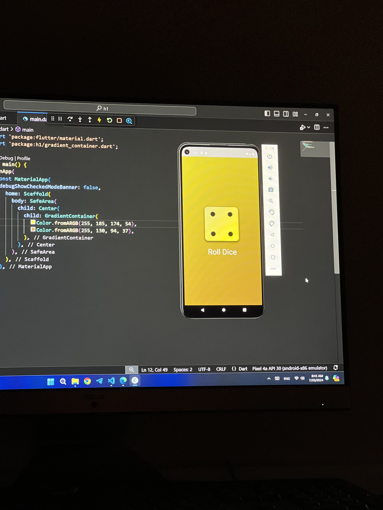
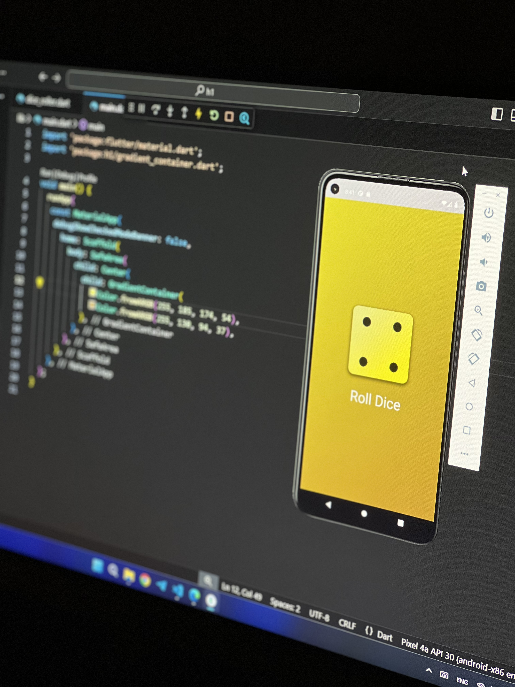

# Dice Roller App

Welcome to the Dice Roller App, a simple yet fun application developed using Flutter. This app allows users to roll a virtual dice and view the result instantly.

## Features

- **Roll Dice**: Shake or press a button to roll the dice.
- **Dice Animation**: Enjoy smooth animations as the dice roll.

## Installation

To get started with this project, follow these steps:

1. **Clone the Repository:**
   ```bash
   git clone https://github.com/yourusername/dice-roller-app.git
2. **Navigate to the Project Directory:**
    ```bash
    cd dice-roller-app
3. **Install Dependencies:**
   ```bash
   flutter pub get
4. **Run the Application:**
   ```bash
   flutter run

## Usage
- **Roll the Dice:** Press the roll button to roll the dice.
- **View Results:** The result will be displayed on the screen with a smooth animation.

## Screenshots

<div style="display: flex; gap: 10px;">
  
  
</div>

## Contributing
If you want to contribute to this project, feel free to open issues or submit pull requests. Your feedback and contributions are highly appreciated!

## Contact
For any questions or feedback, you can reach out to me at [Hissah.khalid@hotmail.com](mailto:Hissah.khalid@hotmail.com). 

## License
 ```bash
  Copyright 2024 Hissah Khalid.
